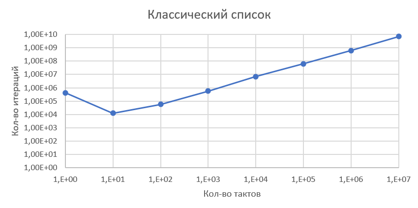
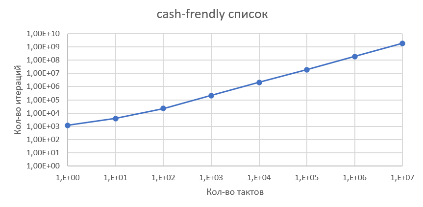

# Сравнение скоростей работы классического списка (реализовано с использованием указателей) и cash-frendly списка (реализовано с использованием индекса)

Измерения проводились на операционной системе Linux (запущенной с помощью WSL):
1) с флагами компилеляции: "-fno-sanitize=address -fno-sanitize=undefined" для отключения Sanitizers, влияющего на скорость работы программы 
2) с флагами компиляции -o0, определяющими уровень оптимизации компилятора
3) и с отключеным режимом верификации и графической распечатки списка (без флагов "-DDEBUG" при компеляции)

Для отключения троттлинга процессора использовалась команда 
"performance | sudo tee /sys/devices/system/cpu/cpu*/cpufreq/scaling_governor"

При измерениях были закрыты остальные программы для чистоты эксперимента, а ноутбук был подключен к зарядному утройству для повышения производительности.

Для замера времени использовалась функция __rdtsc() 

Тестовая задача для списка представляла из себя цикл из большого количества интераций включающих добавление и удаление элемента из списка:

    ListEl_t* node2 = List_Insert_After(node1, 10);
    List_Delete(list, node2);

Измерения проводились в сериях по 8 измерений, содержащих разное количество итераций (диапазон измерений: от 1 до 1е10 итераций). 
Результаты эксперимента представлены ниже. По полученным данным построенны графики в логарифмических осях, отражающие результаты эксперимента.

## Для классического списка
| Кол-во итераций | Кол-во тактов | Тактов/итерацию |
|-----------------|---------------|-----------------|
| 1               | 4.27E+05      | 4.27E+05        |
| 1.00E+01        | 1.26E+04      | 1.26E+03        |
| 1.00E+02        | 5.74E+04      | 5.74E+02        |
| 1.00E+03        | 5.75E+05      | 5.75E+02        |
| 1.00E+04        | 6.81E+06      | 6.81E+02        |
| 1.00E+05        | 6.23E+07      | 6.23E+02        |
| 1.00E+06        | 6.28E+08      | 6.28E+02        |
| 1.00E+07        | 7.06E+09      | 7.06E+02        |

## Для cash-frendly списка
| Кол-во итераций | Кол-во тактов | Тактов/итерацию |
|-----------------|---------------|-----------------|
| 1               | 1,180         | 1,180.00        |
| 1.00E+01        | 3,920         | 392.00          |
| 1.00E+02        | 21,980        | 219.80          |
| 1.00E+03        | 208,600       | 208.60          |
| 1.00E+04        | 2,104,900     | 210.49          |
| 1.00E+05        | 18,649,880    | 186.50          |
| 1.00E+06        | 185,717,203   | 185.72          |
| 1.00E+07        | 1,848,202,857 | 184.82          |

После обработки измерений получаем, что среднее время выполнения 1 итерации составило:

Для классического списка: (428437509 +- 9093183) тактов процессора (относительная погрешность 0.2%)*

Для cash-frendly списка:  (108197196 +- 1211203) тактов процессора (относительная погрешность 1.2%)*

*Погрешность высчитываем как среднее отклонение от среднего

## Итог работы
Ускорение работы списка: 3.96 +- 0.06 (относительная погрешность 1.4%)

Также заметим, что равномерный рост времени в зависимости от количества итераций наблюдается только после примерно 50 итераций. Это значит, что скорость работы программы при небольшом количестве итераций (<<100) значительно снижается и выходит на постоянную величину тольку при увеличении количества итераций.
